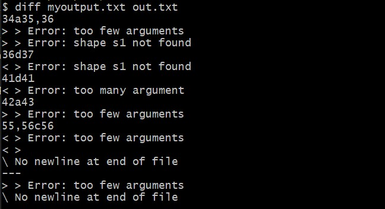
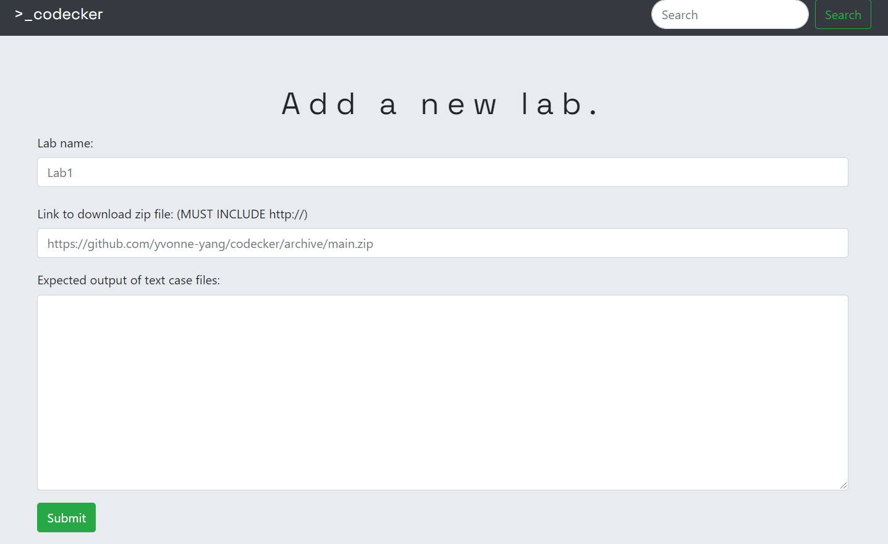
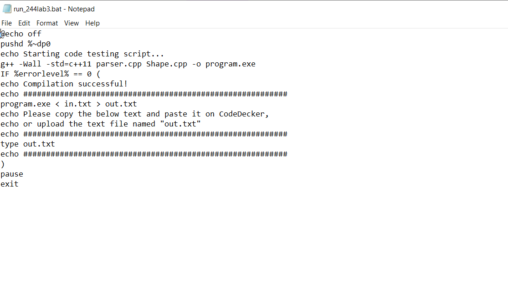

# >\_codecker

A website that allows you to test your code against crowdsourced test cases, and increase chances of not failing APS105 by 1%.

## Inspiration
As students ~dying~ in programming labs, we are always debugging and checking differences between our output and the solution. `diff` is a powerful command line tool to do this. But its outputs is......quite enigmatic.  

  

This isn't even the worst part. Making the test cases themselves can take so many days. How can you guarantee that you checked for all the corner cases? So we thought, what if we could put together all the test cases that every person made, and have a beautiful UI to show differences between output files?
So, here's to my poor Reversi AI and to whoever thought using automarkers alone to mark coding assignments is fair.

## What it does
The front page of Codecker shows all the courses we currently support. It's easy to search, add courses, edit their descriptions, and delete them.

Similarly, within each class, the administrator can add assignments with a zip file for download and the expected output. The zip file contains the test case and a .bat file that helps compile and run the program.

## How we built it
Yvonne wrote the batch script to compile programs and generate an output file. Jack handled the backend of the website, with Restful Routing and the database (MongoDB). Grace worked on the frontend of the website, the logo and directed our demo videos.

## Challenges we ran into
Writing an algorithm to compare two files in Javascript was the biggest challenge. We had to research and use open source code to our aid (many thanks to [this](https://thiscouldbebetter.wordpress.com/2013/02/02/finding-differences-between-two-text-files-in-javascript/)).

## Accomplishments that we're proud of
Having a fully functioning website! The UI is gorgeous and all of the basic features are implemented, too. 

## What's next for >\_codecker
Deploying  codecker to be used by students, additional features, finding administrators to manage the database and the website, and touching up on the UI to make it look even nicer.
